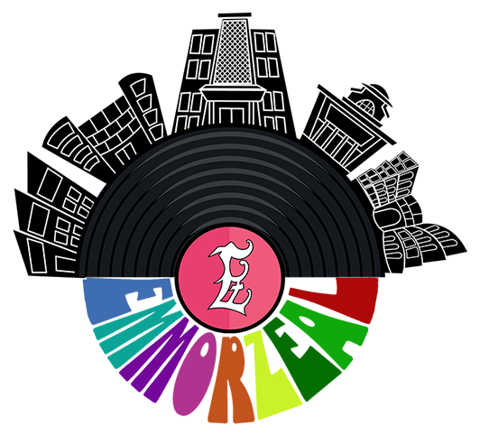

<h1 align="center" id="title">EMMORZEAL</h1>

This project is basically made for my college name Bunts Sangha’s S.M.Shetty College of Science Commerce &amp; Management Studies Powai. Permanently Affiliated to University of Mumbai. In which they have a biggest event named Emmorzeal which is an intra college event in mumbai.

<h2>🚀 Demo</h2>

[www.emmorzeal.com](www.emmorzeal.com)

<h2>Project Screenshots:</h2>

  
  
<h2>🧐 Features</h2>

Here're some of the project's best features:

*   Students can register themselves for their specific events
*   A landing page
*   A team section to display all the HOD & Volunteers
*   A Gallery section to be update with the photos clicked during the event
*   A scoreboard section for being updated with their college score

  

<h2>🧐 Features</h2>

Here're some of the project's best features:

*   Login page for admins 
*   Admin Dashboard that can give info like Total Registration, Total Users, Total Events, Total Colleges
*   Events CRUD Operation 
*   A dedicated page for CRUD operation over the registrations of students 
*   A dedicated page for CRUD operation over the Admin Users
  
<h2>💻 Built with</h2>

Technologies used in the project:

*   HTML
*   CSS
*   jJS
*   pPHP
*   MYSQL

 
<h2>🛡️Contact</h2>

Feel free to contact me through my LinkedIn or my Mail

 
<h2>💖Exciting Feature</h2>

This project exciting feature for automatically generating a PDF Report for all the registered participants

